# Galax Hero: End-to-End Completion and Improvement Plan

**Plan date:** 2026-07-31  
**Engine baseline:** Godot 4.7.1  
**Current project version:** 0.19.0  
**Primary release target:** Windows PC  
**Planning assumption:** One primary developer; effort ranges are solo-development estimates and should be re-baselined after the first vertical-slice playtest.

---

## 1. Purpose

This is the execution plan for turning the current architecture-and-content proof into a complete, polished, testable, distributable game. It supersedes the assumption that a feature is finished merely because its data model or isolated acceptance test exists.

The project is finished only when a player can discover, install, configure, play, complete, replay, and uninstall the shipping build without developer assistance, and when the developer can build, test, publish, diagnose, patch, and support it through a documented and repeatable process.

The plan deliberately prioritizes a truthful playable loop before adding more content. Existing systems should be integrated, proven, and polished before the 60-stage campaign is treated as content-complete.

---

## 2. Release Definition

### 2.1 Version 1.0 must deliver

- A polished vertical-scrolling shooter with readable combat at a stable 60 FPS on the declared minimum PC specification.
- A complete six-operation, 60-stage campaign with stage replay, optional routes/objectives, checkpoints, minibosses, operation bosses, dialogue, progression, and New Game Plus.
- Meaningful ship, weapon, spell, equipment, statistic, and skill-tree choices that are usable through complete in-game menus.
- Campaign, Arcade, Score Attack, Boss Rush, Boss Practice, Survival, Endless, Time Attack, Daily/Weekly Challenge, and Training entry points, with clearly stated reward and leaderboard rules.
- Keyboard/mouse and controller support across gameplay and every menu, with full remapping and no dead-end focus states.
- One- and two-player local cooperative play across every supported mode and campaign stage.
- Two-player online cooperative play only after real-machine network validation meets the release gates in this document.
- Complete settings, accessibility, save recovery, offline fallback, achievements, cloud-conflict handling, and platform integration.
- Final art, animation, VFX, UI, music, and sound design; no programmer shapes, generic prose, silent screens, or knowingly placeholder content in the shipping path.
- A signed, versioned Windows release build with clean-machine installation, upgrade, rollback, crash-diagnostic, and support procedures.
- Verified rights for every distributed asset plus a complete credits/attribution record.

### 2.2 Explicit non-goals for 1.0

These may be evaluated after launch but must not delay a stable 1.0:

- Four-player local or online play.
- Competitive PvP.
- Cross-platform console releases.
- Cross-platform accounts, progression, or matchmaking.
- Dedicated servers or host migration.
- Voice acting.
- User-generated content or mod support.
- Global online leaderboards unless anti-cheat, privacy, moderation, and operating costs are separately approved.

---

## 3. Audited Baseline

The following snapshot is based on the repository as audited on 2026-07-31.

| Area | Current evidence | Readiness | Planning implication |
|---|---|---:|---|
| Architecture | 188 production GDScript files, roughly 10,081 lines, scoped services, sessions, typed events, stable content IDs | Strong foundation | Preserve boundaries, but prove them in the actual game loop |
| Automated tests | All 18 Phase 2–19 acceptance scripts pass | Good isolated coverage | Add full runtime, visual, soak, hardware, network, and clean-build tests |
| Runtime boot | Main scene boots headlessly without errors | Good | Add interactive smoke automation and failure-path coverage |
| Test hygiene | Several suites report leaked ObjectDB instances/resources; Phase 13 reported 717 objects and 187 resources in use at exit | Needs work | Treat clean shutdown and leak-free tests as a release gate |
| Campaign model | Six operations and 60 stage definitions exist | Structural only | Replace templated/reused encounters and prose with authored, playtested content |
| Stage runtime | Stage graph, checkpoints, objectives, secrets, and segment orchestration exist | Partial | Implement the actual hazards, objective actors, branches, encounter selection, and stage pacing |
| Regular enemies | 20 definitions exist, but generated mission spawns do not inject a combat target, projectile pool, or difficulty profile | Release blocker | Wire real enemy attacks and add end-to-end combat tests before content expansion |
| Encounter variety | Most combat/elite segments reuse `wave.arrowhead`; mission enemy rosters do not currently drive wave composition | Release blocker | Build mission-aware encounter packages and verify roster identity per stage |
| Hazards | Hazard IDs currently create empty `Node2D` placeholders | Release blocker | Implement a validated hazard registry and playable hazard behaviors |
| Player combat | Primary weapon and some movement actions are connected | Partial | Connect loadouts, spells, melee, parry, shield, super mode, heavy/secondary fire, and wingman commands |
| Objectives and rewards | Models exist; runtime hookup is narrow | Partial | Drive every objective and drop through real gameplay events and visible feedback |
| Progression | Profile, stats, inventory, skills, upgrades, rewards, and saves exist | Backend-heavy | Add a complete hangar/loadout/progression UX and use selected values at mission launch |
| Modes | Mode definitions/controllers exist | Backend-only | Add selection, launch, results, restart, leaderboard, and persistence flows |
| Local co-op | Roster, revive, camera, reward, and HUD systems exist | Prototype | Test two physical devices and every stage/mode; finish join/leave UX |
| Online co-op | Protocol, lobby model, ENet wrapper, prediction, authority, and simulation tests exist | Lab prototype | Connect real transport to the real mission and validate on two machines/networks |
| UI | Menus are primarily built procedurally; campaign, profiles, settings, accessibility, and bindings are exposed | Functional prototype | Create a coherent visual system and expose all shipping features without text overflow/focus defects |
| Art pipeline | 4,786 assets cataloged, 4,779 still `source_only`, only 7 approved for runtime | Major production gap | Approve assets in intentional batches tied to a style guide and content matrix |
| Runtime visuals | 1 background, 2 enemy images, 1 projectile, 1 effect, 1 pickup, and 1 UI panel are approved | Placeholder-heavy | Produce distinct player/enemy/boss/environment/UI presentation sets |
| Audio | 19 audio source assets cataloged; no runtime music/SFX files were found | Not started in shipping path | Create the audio bible, import/mix content, and wire every gameplay/UI event |
| Narrative | Campaign beats and dialogue resources exist; Operations 2–6 use templated prose | Outline only | Write, edit, implement, and playtest the full narrative and codex |
| Localization | Service wrapper exists; no translation catalogs or localized UI content found | Skeleton | Externalize all text and complete at least pseudolocalization before 1.0 |
| Build/export | Windows debug preset and multiple debug executables exist | Development only | Add release preset, version automation, signing, artifact retention, and clean-machine tests |
| Repository hygiene | The workspace root is not a Git repository; no CI configuration was found | Release blocker | Establish version control, ignores, LFS/artifact policy, CI, and protected release tags |
| Resolution | Project runs at a 540×960 portrait viewport while the older plan states 1920×1080 | Decision required | Lock the render/window/aspect strategy and test all supported desktop displays |
| Development flags | Diagnostics are enabled and visible in `project.godot`; only a debug export preset exists | Not shippable | Split development and release configuration and strip developer-only behavior |
| Distribution size | Historical debug builds occupy about 1.2 GB locally; source assets occupy about 2.9 GB | Needs policy | Keep source and historical builds out of release artifacts and normal source history |

### 3.1 What the passing tests do and do not prove

They prove that many data contracts and isolated algorithms are sound. They do not yet prove that:

- a normal enemy can attack and damage a player in the generated campaign;
- all advertised player abilities can be activated from a real device;
- a stage contains eight to twelve minutes of varied, enjoyable gameplay;
- mission rosters, objectives, drops, hazards, branches, tutorials, and rewards are visibly integrated;
- modes and online play are reachable from the shipping UI;
- the campaign is narratively, visually, or mechanically distinct across 60 stages;
- the game meets GPU, input-latency, memory, loading, or network targets on real hardware;
- a clean customer machine can install and play a release build;
- the game is fun, fair, readable, or accessible in human playtests.

---

## 4. Priority Rules

### P0 — Blocks honest gameplay or safe development

- Version control, reproducible build/test entry point, and clean release configuration.
- Real regular-enemy attacks, damage, deaths, drops, and mission failure.
- Player loadouts and all required core actions connected to runtime.
- Non-placeholder hazards, objectives, encounter selection, and stage timing.
- End-to-end Stage 1 loop with no developer intervention.
- Save integrity and upgrade compatibility through every schema change.

### P1 — Blocks alpha/content production

- Final asset style guide and batch import workflow.
- Shipping HUD, menus, loadout/progression screens, tutorial, and results.
- Final Stage 1 art/audio/narrative/balance/performance.
- Operation 1 authored content and two-device local co-op.
- CI, runtime integration tests, memory/leak cleanup, and performance capture.

### P2 — Blocks beta/release

- Operations 2–6 authored content.
- All alternative modes and New Game Plus integrated.
- Real online transport, remote-machine testing, platform provider, and lobby UX.
- Localization pipeline, accessibility audit, achievements, cloud saves, release packaging, legal, store material, and support tooling.

### P3 — Post-1.0 candidates

- Four-player expansion, cross-platform releases, global leaderboards, mod support, replay ghosts, photo mode, additional campaigns, and DLC.

No P2 or P3 item should displace an unresolved P0 defect.

---

## 5. Product Decisions to Lock Before More Content

Record each decision in an Architecture Decision Record under `docs/decisions/`.

1. **Display strategy:** retain a 540×960 logical portrait playfield, define the desktop presentation frame, side-panel behavior, supported aspect ratios, integer/non-integer scaling policy, fullscreen/windowed modes, and ultrawide treatment.
2. **Combat identity:** decide whether classic forward fire or twin-stick aiming is the default, how focus and dash coexist, and which actions are universal versus build-specific.
3. **1.0 multiplayer promise:** decide whether online co-op is a hard 1.0 requirement or a post-launch update. Do not market it until the real-machine beta gate passes.
4. **Art direction:** choose a coherent asset family, pixel density, palette, lighting/VFX style, faction silhouettes, UI visual language, portrait style, and animation quality bar.
5. **Campaign scope:** confirm whether all 60 stages must be individually authored for 1.0. If resources are insufficient, ship fewer excellent stages rather than 60 templated ones and update all public promises.
6. **Progression model:** lock stat meanings, caps, upgrade costs, equipment slots/sets, respec rules, replay rewards, failure rewards, and New Game Plus carryover.
7. **Platform scope:** lock storefront, achievements, cloud-save provider, input provider, networking provider, crash reporting, and any privacy-impacting telemetry.
8. **Minimum specification:** choose representative low/mid/high PCs and controller families for performance and compatibility gates.
9. **Content rating boundaries:** document violence, flashing imagery, language, online interactions, and accessibility notices.

---

## 6. Delivery Sequence

```mermaid
flowchart LR
    A["0. Truthful baseline"] --> B["1. Core runtime integration"]
    B --> C["2. Gold Stage 1"]
    C --> D["3. Asset and content pipeline"]
    C --> E["4. Operation 1 alpha"]
    D --> E
    E --> F["5. Metagame, modes, accessibility, local co-op"]
    F --> G["6. Operations 2–6 content complete"]
    G --> H["7. Online productionization"]
    H --> I["8. Platform and release engineering"]
    I --> J["9. Beta, release candidate, launch"]
    J --> K["10. Post-launch support"]
```

Asset production, narrative writing, audio production, playtesting, and documentation should run continuously after the Gold Stage 1 standards are established.

---

## 7. Phase 0 — Establish a Truthful Baseline

**Target effort:** 1–2 weeks  
**Outcome:** Anyone can clone, test, run, and export the same known baseline, and the project reports its actual readiness accurately.

### Work

- Initialize the intended repository root in Git and make one documented decision about whether `assets/`, `legacy/`, and `project/` share a repository.
- Add a root `.gitignore`, `.gitattributes`, line-ending policy, and Git LFS policy for large binary source assets if those assets belong in version control.
- Remove historical executables from normal working history; retain releases in a versioned artifact store, not in source directories.
- Add `LICENSE`, third-party notices, asset-source manifest, contribution notes, change log, and build instructions.
- Create one task runner script for: import validation, all acceptance suites, headless boot smoke, debug export, release export, and artifact checks.
- Add CI on a pinned Godot version. Fail on test failure, parse/load errors, content validation errors, export failure, unapproved runtime assets, or committed build/cache artifacts.
- Make all tests delete their temporary profiles/checkpoints and clean up nodes/resources before exit.
- Investigate and eliminate the ObjectDB/resource/RID leak warnings, starting with Phase 13 and then Phases 8–14.
- Split development and release configuration. Release must disable visible diagnostics, development flags, console wrapper, test labs, source scripts where appropriate, and debug-only shortcuts.
- Add a real release export preset with semantic version, build number, PCK policy, icon, metadata, signing hook, and deterministic output path.
- Add a `KNOWN_ISSUES.md` that distinguishes implemented, integrated, playtested, and shipping-ready states.
- Capture a baseline video/screenshots, startup time, memory usage, frame timings, and build size on each reference PC.
- Reconcile the 540×960 project viewport with the older 1920×1080 target and document the final scaling rules.

### Exit gate

- Fresh checkout → import → all tests → headless boot → Windows debug export succeeds through one command.
- The same commit produces the same content revision and version metadata.
- Test process exits without ObjectDB, resource, or RID leak warnings.
- Debug and release builds visibly differ in diagnostics and console behavior.
- Repository, dependency, license, and artifact policies are written and enforced.

---

## 8. Phase 1 — Complete the Real Gameplay Runtime

**Target effort:** 3–6 weeks  
**Outcome:** The generated mission is a real shooter, not a sequence of data-validation demonstrations.

### 8.1 Enemy and encounter integration

- Update generated enemy spawning to inject a valid target, projectile pool, difficulty profile, player count, formation membership, deterministic seed, and source-player attribution.
- Select targets deterministically in solo, local co-op, and online-authority contexts; support retargeting after death/down/disconnect.
- Prewarm and budget player bullets, enemy bullets, missiles, mines, pickups, impacts, and explosions.
- Connect formations to spawned actors: position offsets, leader promotion, ordered-kill tracking, escape behavior, completion bonuses, and cleanup.
- Make mission enemy rosters and factions drive encounter composition. Stop reusing one `wave.arrowhead` as the primary content for unrelated stages.
- Add encounter packages with weighted wave choices, difficulty variants, co-op variants, and deterministic seed output.
- Handle enemy escape/timeouts explicitly so a wave can never deadlock.
- Connect enemy score, XP, currency, drops, destruction VFX/SFX, hit feedback, and chain events to the session.

### 8.2 Player combat integration

- Build the player from `GameSessionConfig.loadouts`, not only from each ship's default pulse cannon.
- Equip and activate primary, secondary, heavy, spell, melee/parry, shield, super mode, and lock-on systems when present in the loadout.
- Wire every advertised input action to gameplay and remove or clearly disable actions that are not part of the selected build.
- Resolve default-binding conflicts such as focus and dash sharing the same controls; test press, hold, toggle, and rebinding behavior.
- Implement auto-fire, focus-toggle, and shield-toggle accessibility settings in runtime, not only in stored settings.
- Apply equipment, skill, temporary-upgrade, status, difficulty, and co-op modifiers to the real player actor.
- Add cooldown, heat, charge, ammunition/energy, lock-on, weapon-switch, spell-energy, super-charge, and wingman-command HUD feedback.
- Implement death, downed, revive, lives, continue, checkpoint restore, game over, abandon mission, and restart flows.

### 8.3 Stage mechanics

- Replace empty hazard nodes with a hazard registry/factory and concrete asteroid, debris, ion storm, minefield, turret wall, orbital weapon, and environmental collision behaviors.
- Spawn objective actors for rescue, escort, protect, collect, sabotage, and marked-target objectives.
- Connect objective success/failure to actual events, rewards, dialogue, HUD, branch availability, and stage rank.
- Implement visible, player-selectable branch decisions and secret triggers; ensure generated graph choices match what the player sees.
- Replace 0.1-second placeholder survival durations with authored timings.
- Ensure checkpoint snapshots restore active enemies/hazards/objectives/boss state or intentionally restart the encounter with documented rules.
- Add scrolling bounds, spawn/despawn bounds, safe areas, stage transitions, and background movement that match the portrait playfield.
- Define stage failure conditions and ensure failure can never accidentally grant completion rewards.

### 8.4 Scoring, progression, and telemetry

- Implement the campaign chain system with inactivity timeout, break reasons, multipliers, feedback, and event emission.
- Define score categories and rank thresholds per stage/mode; show the breakdown in results.
- Route all rewards through idempotent transactions, including drops, objectives, boss parts, secrets, co-op, and reconnect cases.
- Record truthful mission metrics: time, damage taken, deaths, revives, chain, accuracy where applicable, objectives, route, seed, difficulty, assists, and performance peaks.
- Keep player-facing analytics local unless a separate privacy-reviewed telemetry decision is approved.

### Required integration tests

- A regular enemy fires a hostile projectile that can damage and defeat the player.
- A player projectile kills a regular enemy, advances the wave, awards the correct owner, and returns pooled objects cleanly.
- Every core player action activates the selected runtime exactly once per intended input.
- Every objective type succeeds and fails through real gameplay events.
- Every hazard type can damage/affect actors and clean itself up.
- Solo and two-player targeting, drops, revives, checkpoints, and results behave correctly.
- Losing, restarting, abandoning, and completing a stage cannot duplicate rewards or corrupt the profile.

### Exit gate

- A developer can play Stage 1 from menu to results using keyboard or controller without debug calls.
- Enemies attack, the player can die, the stage can be failed, and every completion is earned through gameplay.
- All core controls, loadout systems, objectives, hazards, drops, scoring, checkpoints, and rewards are visibly functional.
- A 30-minute soak produces no growing actor/pool count, unhandled error, stuck wave, or leaked object warning.

---

## 9. Phase 2 — Build the Gold Standard Stage 1

**Target effort:** 5–8 weeks  
**Outcome:** Stage 1 defines the final quality bar for every later stage.

### Design and pacing

- Create a written Stage 1 beat sheet with target timestamps, teaching goals, intensity curve, route choice, optional objective, checkpoints, miniboss, boss phases, and cooldown moments.
- Target 8–12 minutes for a first successful run, with a faster expert route and no dead time.
- Teach movement, fire, focus, chain, pickup/temporary upgrade, shield/spell, objective, checkpoint, and boss telegraphs through play, concise prompts, and safe practice spaces.
- Add at least three mechanically distinct regular encounter packages and one memorable elite encounter.
- Make the optional route meaningfully different without punishing a first-time player for choosing either path.
- Tune Story/Normal/Veteran/Nightmare presets plus the 0–100 custom difficulty so patterns remain valid and readable.

### Final presentation

- Select final player, enemy, miniboss, boss, projectile, pickup, environment, portrait, and UI assets from the catalog.
- Create/import final animation frames, collision shapes, attachment points, muzzle positions, boss-part regions, and sprite scale metadata.
- Add layered scrolling environment art, foreground flyovers, lighting, particles, weather/hazard treatment, transitions, and a distinct boss arena.
- Replace programmer-drawn player/projectile shapes and all placeholder silhouettes in the shipping route.
- Create final hit sparks, shield impacts/break, armor hits, status effects, muzzle flashes, explosions, pickup feedback, chain effects, boss transitions, and results celebration.
- Establish projectile readability rules: hostile/friendly palettes, outlines, dangerous core, cosmetic halo, hitbox consistency, and reduced-flash variants.

### Audio and narrative

- Write and edit the final Stage 1 briefing, radio chatter, objective calls, boss lines, failure lines, results, and codex unlocks.
- Import and mix title/menu, briefing, stage, miniboss, boss, results, and ambient music states.
- Add final SFX for UI, player movement, every Stage 1 weapon/spell, enemies, projectiles, impacts, pickups, hazards, checkpoints, warnings, boss parts/phases, victory, and defeat.
- Implement bus presets, side-chain/ducking behavior, voice limits, loudness targets, dynamic-range modes, and missing-audio validation.

### UX and accessibility

- Build a shipping-quality HUD with health/shield/resources, weapon/spell status, chain/score, objectives, warnings, boss state, co-op state, and readable safe margins.
- Finish pause, restart, checkpoint resume, tutorial skip/replay, accessibility, controls, and result flows.
- Verify text scale, UI scale, colorblind modes, projectile colors/outlines, flash reduction, motion reduction, particle density, shake, game-speed assistance, simplified patterns, aim assist, auto-fire, and invulnerability assist.
- Add a photosensitivity warning and clear online/achievement/leaderboard eligibility indicators when assists affect a mode.

### Human playtest matrix

- First-time shooter player.
- Experienced bullet-shooter player.
- Keyboard/mouse player.
- Xbox-layout, PlayStation-layout, and Nintendo-layout controller players.
- Low-vision/color-vision test passes.
- Reduced-motion and reduced-speed passes.
- Fresh profile, expected build, weak build, overpowered build, and co-op build.

### Exit gate

- Ten representative external playtesters can start, understand, finish, and explain the stage's core loop without developer coaching.
- At least 80% finish on Normal within three attempts; failures have a player-understood cause.
- No temporary art/audio/prose remains in Stage 1.
- Stage 1 meets the performance, readability, accessibility, save, controller, and clean-export gates.
- A signed-off Stage 1 content checklist becomes the template for every later stage.

---

## 10. Phase 3 — Productionize the Asset and Content Pipeline

**Target effort:** 3–5 weeks for tooling, then continuous content batches  
**Outcome:** Content volume becomes repeatable, reviewable, licensed, performant, and visually coherent.

### Asset pipeline

- Create an art bible covering resolution, scaling, orientation, pivot, palette, faction silhouette, value range, outline, animation cadence, shadow, emissive treatment, projectile size, and UI density.
- Triage all 4,786 catalog entries into `approved`, `candidate`, `duplicate`, `source_only`, `rejected_style`, `rejected_quality`, and `license_hold`.
- Start from content needs, not raw asset count. Approve complete families for one operation at a time.
- Automate safe copy/conversion from source to `assets_runtime/`, deterministic filenames, import-profile checks, hash/duplicate checks, and content-definition link validation.
- Add sprite-sheet slicing, animation preview, anchor/pivot overlay, collision preview, muzzle/attachment authoring, and atlas-candidate tooling.
- Generate a runtime asset report that fails CI on missing files, unapproved paths, invalid dimensions, unresolved licenses, duplicate runtime names, or oversized textures/audio.
- Preserve editable source formats outside export and verify the release contains only required runtime derivatives.
- Produce a machine-readable and human-readable credits/attribution manifest even where attribution is not legally required.

### Content tools

- Expand the mission editor into an operation/stage authoring tool that can select encounter packages, objectives, hazards, branch rules, environment layers, rewards, dialogue hooks, and review seeds.
- Add live preview for wave paths, formation bounds, projectile patterns, co-op clearance, safe zones, boss phases/parts, and accessibility variants.
- Add batch validation for encounter duration, spawn safety, projectile budget, deadlocks, missing reward hooks, unreachable branches, absent checkpoints, and duplicate stage identity.
- Replace large in-code content generation with versioned declarative resources or generated artifacts whose source data is diffable and reviewable.
- Export a campaign content matrix showing every stage's mechanics, enemies, waves, hazards, objectives, routes, rewards, art, music, dialogue, bosses, test status, and owner.

### Exit gate

- A new enemy, wave, encounter, stage, boss phase, dialogue sequence, and reward can each be created and validated without writing a one-off runtime script.
- Operation content can be reviewed through tools before a full playthrough.
- Runtime imports are reproducible and every shipping asset has an approved license/style/performance status.

---

## 11. Phase 4 — Complete Operation 1 Alpha

**Target effort:** 8–12 weeks  
**Outcome:** Ten distinct, complete stages prove the campaign production pipeline.

### Per-stage minimum content contract

Every stage must include:

- An authored 8–12 minute beat sheet and intensity curve.
- A unique mission purpose, teaching/reinforcement goal, visual identity, and story consequence.
- Multiple encounter packages using the declared mission roster, not one shared formation.
- At least one stage-specific environmental or objective mechanic.
- A midpoint checkpoint and pre-boss checkpoint with verified restore behavior.
- One miniboss with a recognizable silhouette, attack identity, telegraphs, and practice entry.
- Optional objective/route/secret content where declared by the operation bible.
- Final briefing, radio, results, codex, rewards, unlocks, music states, SFX, and accessibility review.
- Solo, two-player local co-op, four difficulty presets, custom difficulty bounds, and three deterministic review-seed passes.
- Performance, save/reload, restart, abandon, replay, and reward-idempotency verification.

### Operation-wide work

- Give the 20-enemy roster distinct silhouettes, roles, movement, attacks, defenses, sounds, drops, and counters.
- Build reusable encounter families, then author stage-specific compositions and pacing.
- Make all ten minibosses meaningfully distinct; variants may share a framework but not the same full encounter.
- Produce a multi-phase Operation 1 boss with final art, destructible parts where supported, arena mechanics, music transitions, checkpoints, challenges, practice, and NG+ variant.
- Finalize the three initial ships, pilot identities, Rook wingman, starter weapons/spells, equipment, skills, and unlock cadence.
- Write and edit the complete Operation 1 narrative arc with consequences visible in missions or dialogue.
- Perform fresh-profile economy runs and remove any required grind while retaining meaningful choices.

### Exit gate

- Operation 1 can be played from a new profile to completion in solo and two-player local co-op.
- No two stages feel like palette-swapped copies in blind playtest feedback.
- The operation is content-, art-, audio-, narrative-, balance-, and accessibility-complete.
- Completing/replaying every stage and restoring every checkpoint leaves a valid profile.
- Operation 1 is a credible public demo without debug explanation.

---

## 12. Phase 5 — Complete the Metagame, Modes, Accessibility, and Local Co-op

**Target effort:** 6–10 weeks  
**Outcome:** All existing backend systems become coherent player-facing features.

### Front end and navigation

- Replace the prototype main menu with a cohesive shell for Continue, Campaign, Modes, Online, Hangar, Codex, Profiles, Settings, Credits, and Quit.
- Build clear first-run flow, profile creation, save-recovery prompts, continue/resume behavior, and safe profile deletion.
- Create an actual campaign map with operation grouping, routes, stage status, rewards, ranks, boss practice, decisions, and replay filters.
- Add loading screens, transition states, progress indicators, error dialogs, confirmation flows, notifications, and disconnected-device handling.
- Preserve controller focus through dynamic lists, popups, scrolling, page changes, and hot-plug events.

### Hangar and progression

- Build ship, pilot, weapon, spell, melee/super, wingman, equipment, skill-tree, stat allocation, upgrade, inventory, preset, respec, compare, sell/dismantle, and codex screens.
- Explain actual stat deltas and build behavior before the player spends resources.
- Validate loadouts against unlocks, ship restrictions, mode rules, co-op slots, missing content, and save migration.
- Ensure the selected pilot perspective, ship, loadout preset, equipment, skills, and wingman reach the mission runtime.
- Add undo/confirm for irreversible purchases and clear duplicate-conversion feedback.

### Alternative modes

- Add mode-select, rule/configuration, seed, loadout, difficulty, assist eligibility, launch, pause, results, retry, and leaderboard flows.
- Implement the actual gameplay lifecycle for Arcade, Score Attack, Boss Rush, Boss Practice, Survival, Endless, Time Attack, Daily/Weekly Challenge, Training, and Mutator runs.
- Ensure mode results never mutate campaign data unless the mode explicitly grants an approved reward.
- Persist local leaderboards and challenge history with version/content/difficulty/assist metadata.
- Add fast retry and deterministic seed replay where score/time mastery depends on repetition.
- Make Training expose encounter, formation, boss phase, projectile pattern, resources, speed, hitboxes, damage numbers, reset, and no-reward status through UI.

### Local co-op

- Add join/leave, device ownership, guest/profile choice, ship/loadout selection, ready state, duplicate-device prevention, and reconnect UI.
- Verify keyboard plus controller and two-controller combinations on supported devices.
- Tune shared camera, tether warnings, teleport recovery, down/revive, lives, pickups, chain, objectives, boss targeting, pause ownership, dialogue, and menus.
- Establish reward rules for host, local profiles, guests, duplicate claims, and disconnects; state them in the UI.
- Play every Operation 1 stage and each supported mode with two physical players.

### Accessibility and localization foundation

- Apply every stored setting to all relevant UI/gameplay/presentation systems and test persistence across updates.
- Add subtitle/background options, readable font, full text-size coverage, icon-plus-color encoding, audio cues with visual equivalents, and configurable hold/toggle/repeat behavior.
- Externalize all player-facing text into translation keys and remove concatenation patterns that cannot be localized safely.
- Run pseudolocalization for string expansion, complex characters, missing glyphs, layout overflow, and right-to-left readiness even if 1.0 ships in one language.
- Create an accessibility conformance checklist and test it per screen, mechanic, boss, and mode.

### Exit gate

- Every backend feature promised for 1.0 is reachable, explainable, usable, and persistent through shipping UI.
- Complete menu traversal is possible with keyboard only and each controller family without pointer input.
- Operation 1 and all implemented modes pass the two-device local co-op matrix.
- Pseudolocalized UI has no blockers and accessibility settings materially change the intended systems.

---

## 13. Phase 6 — Author Operations 2–6 and Finish the Full Campaign

**Target effort:** 25–40 weeks  
**Outcome:** The structural 60-stage campaign becomes a genuinely authored game.

### Current implementation evidence (verified 2026-08-01)

Operations 2–6 are implemented as fifty authored narrative records, mission recipes, campaign nodes, minibosses, five distinct three-phase finale bosses, specialist ships, equipment sets, spell-unlock beats, decision echoes, and operation-specific rosters and environments. `phase18_acceptance.gd` passes all 37 checks, including the full 60-stage fresh-profile progression, deterministic seed batches, local co-op clearance, save reload, mode reuse, and New Game Plus preview. The factory's narrative responsibilities are isolated in `FullCampaignNarrativeFactory`, keeping each campaign-content implementation file below 300 lines. Human gameplay, art, audio, balance, accessibility, and fun sign-off remain external release gates.

### Content strategy

- Produce one operation at a time in three gates: three-stage proof batch, stages 4–7 mid batch, stages 8–10 finale batch.
- Do not begin the next operation until the current operation passes its content, performance, narrative, economy, co-op, and regression gates.
- Use operation bibles as constraints, then replace factory-generated placeholder prose, generic mission identities, duplicated boss templates, and recycled stage rhythms.
- Give each operation a distinct environment family, enemy faction mix, mechanic progression, music palette, narrative problem, reward identity, and finale.
- Reuse systems, not finished encounters. Repetition should build mastery while compositions, timing, combinations, and stakes change.

### Per-operation targets

- Ten complete stages meeting the Stage 1 content contract.
- A coherent enemy roster with introductions, combinations, elites, and returning variants.
- Ten authored miniboss encounters and one unique three-or-more-phase operation boss.
- Final operation-specific backgrounds, foregrounds, hazards, UI accents, VFX palette, music, ambience, and SFX additions.
- Twenty final briefing/results sequences plus in-stage radio, decisions, codex entries, and consequence callbacks.
- A specialist ship, equipment set, spell/unlock beats, progression targets, and build counters.
- Fresh, expected, weak, overpowered, accessibility, NG+, solo, and co-op balance passes.

### Campaign-wide passes

- Narrative continuity, character arcs, decision payoff, terminology, tone, codex, and ending variants.
- Unlock pacing, stat/skill economy, weapon/spell costs, equipment sets, drops, replay rewards, failure rewards, and level curve.
- Difficulty curve, tutorial handoff, enemy introduction cadence, mechanic combinations, checkpoint placement, and boss escalation.
- Visual continuity, sprite scale, collision consistency, projectile readability, effect budgets, audio mix, and loading transitions.
- Full New Game Plus rules: retained progress, harder variants, route/content changes, rewards, save compatibility, and completion conditions.
- Full-campaign save upgrade, checkpoint, replay, mode reuse, solo, local co-op, and performance regression matrix.

### Exit gate

- Every stage has signed-off gameplay, art, audio, narrative, balance, accessibility, and QA records.
- A new profile can complete the campaign without required replay grinding or developer intervention.
- Decisions have visible consequences and all ending/postgame states persist correctly.
- At least three full solo and three full local-co-op campaign playthroughs complete without progression blockers or save corruption.
- Content is frozen except for bugs, balance, accessibility, performance, and editorial corrections.

---

## 14. Phase 7 — Productionize Online Co-op

**Target effort:** 10–16 weeks  
**Outcome:** The network lab becomes a secure, observable, usable two-machine feature.

### Current implementation evidence (verified 2026-08-01)

The host-authoritative protocol, compatibility handshake, lobby state, direct-IP transport, prediction/reconciliation, event-based projectile replication, checkpoint-safe reconnect, duplicate-reward protection, diagnostics, and rollout policy are implemented. `phase19_acceptance.gd` passes all 19 checks, and Phase 6/7 combat and enemy foundations also pass their 12- and 15-check suites. Public online remains intentionally disabled under [ADR 0003](decisions/0003-multiplayer-release-scope.md) until the plan's two-machine/two-network, invite-provider, latency/loss, soak, and full-campaign external test matrix is completed; this preserves the stated no-unverified-online release policy.

Do this phase only after local co-op and campaign content are stable. If its release gates cannot be met, move online co-op out of 1.0 rather than weakening the offline game.

### Transport and lobby

- Connect `OnlineTransport` to the lobby and session coordinator, including connection-success/failure signals, peer identity, timeout, retry, orderly shutdown, and user-readable errors.
- Implement the real host/join/direct-IP flow and the selected platform's lobby/invite flow.
- Add compatibility handshake before profile/loadout transfer; reject protocol, build, content, mod, or rules mismatches clearly.
- Add host settings, privacy, ready state, ship/loadout validation, invitations, leave/kick behavior where appropriate, and no-host-migration messaging.
- Define NAT/firewall expectations and provide a tested fallback or support instructions.

### Authoritative gameplay integration

- Drive the real mission from host authority for seeds, graph, spawns, enemies, hazards, objectives, boss phases/parts, damage, deaths, drops, score, checkpoint, and rewards.
- Send client input at a measured rate; reconcile the actual local player actor and interpolate remote actors.
- Replicate projectile spawn/interactions and deterministic patterns without trusting client damage claims.
- Synchronize pause policy, dialogue readiness, results, stage transition, retry, abandon, and return-to-lobby states.
- Connect disconnect AI takeover, 30-second reconnect, checkpoint restore, reward eligibility, host abort, and profile persistence to UI.
- Bound message size/rate, validate every payload field/type/range, reject replay/out-of-order/authority-forged events, and fuzz malformed packets.
- Never deserialize arbitrary objects from untrusted network packets.

### Network quality targets

- Test at 0/50/100/150/250 ms latency, jitter, packet loss, duplication, reordering, brief outage, bandwidth cap, and host/client frame drops.
- Define acceptable correction distance/frequency, snapshot age, input delay, projectile divergence, boss divergence, and reconnect time.
- Add opt-in diagnostics export with protocol/build/content versions, ping/loss, correction counts, desync hashes, event sequence, disconnect cause, and no sensitive data.

### Real-world test matrix

- Two processes on one machine.
- Two machines on one LAN.
- Two machines on different consumer networks.
- Direct IP and platform invitation.
- Host/client role reversal.
- Keyboard/controller combinations.
- Every rollout step: Boss Practice → Arcade → one campaign stage → Operation 1 → full campaign.
- Checkpoint disconnect/reconnect, host disconnect, client crash/relaunch, version mismatch, duplicate reward, and corrupt packet scenarios.
- Multi-hour soak plus at least one complete 60-stage online campaign run after content freeze.

### Exit gate

- No client can authoritatively grant itself damage, score, drops, completion, or rewards.
- Real-machine sessions meet documented latency/loss quality thresholds without unbounded drift or growth.
- Reconnect and abort behavior never corrupts or duplicates progression.
- Lobby/invite/error flows are understandable without developer tooling.
- Online diagnostics are sufficient to investigate a player report.

---

## 15. Phase 8 — Platform, Build, Legal, and Release Engineering

**Target effort:** 5–8 weeks, partly parallel  
**Outcome:** A release candidate can be built, signed, distributed, updated, rolled back, and supported.

### Build and packaging

- Pin Godot, export templates, platform SDK/plugin versions, Python tooling, and all generated-tool dependencies.
- Add version generation from release tags plus build/channel/content/protocol identifiers visible in diagnostics.
- Create Development, QA, Demo, Release Candidate, and Release export profiles with explicit include/exclude rules.
- Strip tests, tools, source assets, historical builds, migration logs, development flags, and unneeded legacy content from release.
- Add application icon, executable metadata, save/config locations, portable/debug options, and uninstaller behavior.
- Sign release executables and verify signatures after packaging.
- Produce checksums, software bill of materials, third-party notices, and retained symbols/debug metadata for each release.
- Test clean install, first run, upgrade from every supported save schema, repair, uninstall/reinstall, and rollback.

### Platform features

- Integrate and validate achievements, rich presence, overlay behavior, controller glyphs/input, cloud saves, invitations/lobbies, and offline fallback through the chosen provider.
- Persist local achievement state and reconcile with the provider after offline play.
- Implement real cloud upload/download and explicit local/remote/keep-both conflict resolution.
- Add platform-safe startup when the provider is absent, unavailable, in offline mode, or returns an error.
- Validate account switching, cloud quota/failure, overlay input capture, and invite timing.

### Legal and compliance

- Review every source asset license and preserve proof of purchase/permission where applicable.
- Ensure product name, logo, fonts, music, plugins, SDKs, and third-party code are cleared for commercial use.
- Publish credits, third-party notices, privacy policy if any data leaves the machine, support contact, system requirements, accessibility information, photosensitivity notice, and online-service disclosures.
- Complete relevant store questionnaires, content ratings, and regional requirements.
- Define save/log locations and a user-facing way to export diagnostics without exposing personal data.

### Store and launch material

- Finalize game title treatment, capsule/key art, screenshots, trailer, feature copy, controller/support labels, languages, system requirements, pricing, launch date, and review/demo strategy.
- Capture only shipping-quality footage from the release branch.
- Create a press kit, FAQ, troubleshooting page, known-issues page, community rules for any official space, and support-response templates.
- Prepare launch announcement, patch notes, rollback plan, hotfix branch, and staged rollout checklist.

### Exit gate

- A non-developer can install and play the signed build on a clean minimum-spec machine.
- Release contents match the approved manifest and contain no source-only or developer-only material.
- Save upgrades, cloud conflicts, offline mode, achievements, invitations, and diagnostics export work end to end.
- Legal, store, credits, support, rollback, and artifact-retention checklists are signed off.

---

## 16. Phase 9 — Alpha, Beta, Release Candidate, and Launch

**Target effort:** 8–12 weeks  
**Outcome:** Scope is frozen, evidence supports release, and launch can be operated safely.

### Internal alpha gate

- All 1.0 features are integrated and reachable.
- Placeholder content is allowed only if listed, owned, scheduled, and not used for public judgment.
- Full campaign is completable in solo and local co-op.
- No P0 crash, save-loss, progression blocker, deadlock, or unfinishable stage remains.

### Content-complete gate

- All campaign/mode art, audio, text, rewards, bosses, encounters, achievements, codex, credits, and settings are present.
- No new features after this point without removing equivalent risk and re-approving the schedule.
- Localization strings are frozen except for corrections.

### Closed beta gate

- Recruit a representative device, skill, accessibility, hardware, and network sample.
- Collect structured reports for onboarding, difficulty, readability, builds, stage fatigue, narrative, bugs, performance, co-op, and network quality.
- Record reproduction steps, build, seed, stage, profile state, device, settings, logs, and save snapshot for every defect.
- Tune from aggregated evidence; do not compensate for unclear mechanics only by lowering difficulty.

### Release candidate gate

- Zero open P0/P1 defects; every accepted P2 defect has a documented player impact and workaround.
- All automated, manual, clean-machine, save-upgrade, controller, accessibility, performance, soak, local-co-op, and online matrices pass.
- At least three consecutive release candidates pass without code changes beyond version/packaging metadata.
- Store build, trailer/screenshots, legal text, support docs, known issues, rollback artifact, and day-one patch plan are ready.

### Launch operations

- Stage the release and verify download/install before public activation.
- Monitor crash/support/store/community signals during the first hours and days.
- Triage by severity: save loss/security/crash/progression blockers first, then multiplayer/performance, then balance/polish.
- Never publish a hotfix without automated tests, save-upgrade test, clean launch, and rollback artifact.
- Publish transparent patch notes and update known issues.

---

## 17. Phase 10 — Post-Launch Support and Improvement

**Outcome:** The shipped game remains stable, recoverable, and worth improving.

- Maintain `main`, release, hotfix, and development branches with signed version tags and retained build artifacts.
- Support the current and previous save schema; never silently discard unknown future/optional content.
- Track crash-free sessions only if privacy-approved telemetry exists; otherwise use opt-in diagnostics and support reports.
- Review completion, difficulty, build diversity, boss failures, accessibility usage, co-op/network problems, and support volume.
- Run regression and clean-build suites for every patch.
- Schedule balance changes in batches; preserve mode leaderboard comparability through rules/content versioning.
- Publish a support sunset policy before removing any online dependency.
- Prioritize quality-of-life, accessibility, performance, and reliability before new paid content.
- Re-evaluate P3 features only after launch stability targets have held for at least two patch cycles.

---

## 18. Cross-Cutting Improvement Backlog

### 18.1 Code and architecture

- Keep services and `GameSession` boundaries, but remove legacy autoloads from the production boot once compatibility references no longer require them.
- Replace stringly typed dictionaries in hot/high-risk contracts with typed Resources/classes where it improves validation and refactoring safety.
- Split large orchestration/UI files such as `menu_shell.gd` into scene-backed pages, presenters/controllers, and shared theme resources.
- Add lifecycle ownership rules for every pooled/non-pooled runtime node and enforce cleanup in tests.
- Add structured error codes and player-safe messages at service, save, content, platform, and network boundaries.
- Add deterministic dependency injection for randomness, clocks, filesystem paths, platform providers, and transport providers in tests.
- Profile before optimizing; document hot paths, allocation budgets, pool capacities, and cache ownership.
- Add static formatting/lint policy and treat parser warnings, unsafe casts, shadowed names, and unreachable code consistently.

### 18.2 Gameplay quality

- Tune player acceleration/deceleration, focus speed, dash invulnerability/cooldown, collision forgiveness, and true-hitbox feedback.
- Give each weapon family a clear niche, sensory identity, upgrade path, and drawback; remove numerical duplicates.
- Make spells tactical pattern interactions rather than generic screen damage wherever possible.
- Add enemy role icons/silhouettes and progressive teaching before combining counters.
- Telegraph every dangerous attack through shape, timing, sound, contrast, and safe-space logic.
- Make boss parts visually targetable and keep phase transitions short, informative, and checkpoint-safe.
- Ensure dynamic difficulty is bounded, transparent in metadata, and never changes authored pattern safety.
- Use short replay loops and fast restarts in mastery modes.

### 18.3 Visuals and UI

- Use a project-wide theme resource for typography, color, spacing, panels, buttons, focus, disabled/locked states, and animation durations.
- Add animated focus/selection, clear button prompts, safe-zone layout, and responsive side panels around the portrait playfield.
- Avoid raw dictionary output such as reward previews; format currencies, items, ranks, stats, and rules for people.
- Add comparison arrows, caps, requirements, tooltips, and preview simulations to build screens.
- Use object pooling and effect-level-of-detail for dense combat; never let cosmetic effects hide hostile bullets.
- Add shader/effect fallbacks for compatibility hardware and reduced-flash/motion modes.

### 18.4 Audio

- Define loudness/mix targets and test speakers, headphones, mono, low volume, and night mode.
- Randomize pitch/variation intentionally and prevent important warning sounds from being voice-stolen.
- Give player damage, shield break, low health, lock-on, objective danger, and boss phase cues unique priority.
- Crossfade music by stage/boss state and restore correctly after pause, checkpoint, reconnect, and result transitions.
- Include audio sliders/mute for all exposed buses and verify they affect existing voices.

### 18.5 Narrative

- Create a story bible with timeline, factions, character voices, terminology, decision variables, and ending logic.
- Give each stage a setup, in-mission development, and consequence; keep radio lines short enough for combat.
- Queue/interrupt/replay radio safely so critical lines are not lost during boss, pause, death, or checkpoint events.
- Ensure player choices alter later dialogue/events/routes and are not only stored flags.
- Edit for consistency, accessibility, subtitle speed, localization, and spoiler-safe codex ordering.

### 18.6 Security, privacy, and resilience

- Treat save checksums as corruption detection, not anti-tamper security; never promise cheat prevention for local profiles.
- Sanitize profile names, paths, log output, lobby text, network addresses, and imported content metadata.
- Cap file sizes, packet sizes, arrays, strings, and retry rates before allocating or processing untrusted data.
- Fuzz save/network parsers and preserve corrupt files for recovery rather than overwriting them.
- Keep secrets/credentials outside the repository and release package.
- Document what diagnostics contain and require opt-in before any upload.

### 18.7 Documentation

- Maintain player manual, controls, accessibility guide, troubleshooting, online FAQ, save locations, and recovery guide.
- Maintain developer setup, architecture map, content authoring, asset pipeline, testing, performance, network, release, rollback, and support runbooks.
- Keep phase documents as historical records; mark superseded claims and link to current release readiness.
- Generate content/version/build references automatically to prevent README drift.

---

## 19. Verification Strategy

### 19.1 Automated layers

1. **Static/content validation:** resource IDs, dependencies, licenses, paths, imports, bounds, budgets, translations, and export contents.
2. **Unit tests:** damage, stats, progression, rewards, saves, graph generation, objective rules, difficulty, mode scoring, protocol validation, and migration.
3. **Runtime integration tests:** real player/enemy/projectile/hazard/objective/boss/session nodes in a SceneTree.
4. **Flow tests:** boot → profile → loadout → stage → checkpoint → result → save → replay/mode/next stage.
5. **Export smoke tests:** run the exported executable, create/load profile, enter/exit a mission, and verify expected files/logs.
6. **Soak/fuzz tests:** pools, stage loops, save interruptions, malformed saves, controller hot-plug, network conditions, and reconnect cycles.

### 19.2 Manual matrices

- Hardware: minimum, recommended, high-end; integrated and discrete GPU; single/multiple monitors; common refresh rates.
- Display: windowed/fullscreen/borderless, 1080p/1440p/4K, ultrawide, DPI scaling, focus loss, Alt+Tab.
- Input: keyboard-only, keyboard/mouse, common controller families, two controllers, hot-plug, remapping, duplicate devices.
- Gameplay: every stage, boss, objective, branch, secret, difficulty, assist, ship, weapon family, spell school, and representative build.
- State: fresh profile, migrated profile, corrupt primary save, backup recovery, full inventory, max level, NG+, no platform, offline platform, cloud conflict.
- Multiplayer: solo, local co-op, network roles/conditions, disconnect/reconnect, version mismatch, host loss, reward ownership.
- Accessibility/localization: every relevant setting combination, pseudolocale, text scale, color modes, reduced motion/flash, simplified patterns.

### 19.3 Release performance budgets

Final values must be measured on the minimum-spec PC and written into CI/manual gates.

| Metric | Initial target |
|---|---:|
| Sustained gameplay | 60 FPS |
| 99th percentile frame time | ≤ 16.7 ms at 60 FPS target |
| Worst non-loading gameplay hitch | ≤ 33 ms |
| Normal active hostile projectiles | Authored per encounter and below readability limit |
| Synthetic projectile ceiling | 2,000 pooled projectiles without failure |
| Synthetic enemy ceiling | 150 active enemies without failure |
| Transient effect ceiling | 200 active effects with graceful LOD |
| Stage generation | ≤ 100 ms, preferably off visible transition |
| Checkpoint save | ≤ 100 ms without gameplay hitch |
| Results/profile save | ≤ 250 ms |
| Main menu first interactive | Define after minimum-spec baseline; target ≤ 5 s on SSD |
| Mission transition | Define after final asset batch; no unexplained frozen frame |
| Long soak | 4 hours without crash, deadlock, or sustained memory/pool growth |

Do not use synthetic counters as proof of GPU or real-runtime performance. Capture engine profiler data and frame-time traces on representative hardware.

---

## 20. Milestone Definitions

| Milestone | Meaning |
|---|---|
| Foundation Complete | Reproducible repo/build/test baseline and no known runtime-integration blockers |
| First Playable | Stage 1 can be won or lost through real combat from the normal menu |
| Vertical Slice Gold | Stage 1 meets final gameplay/art/audio/UX/accessibility/performance quality |
| Operation 1 Alpha | Ten complete stages, local co-op, progression, and public-demo quality |
| Feature Complete | All 1.0 systems and modes are integrated; no new feature work |
| Content Complete | All 60 stages and associated art/audio/text/rewards are final |
| Online Beta | Real transport and real-machine rollout gates pass |
| Beta | External testing; only bugs, tuning, performance, accessibility, and editorial fixes |
| Release Candidate | Signed final-content build passes every release matrix |
| Gold | Approved store artifact, rollback artifact, support plan, and launch material are ready |
| Done | Release is live, verified, monitored, documented, and recoverable |

---

## 21. Risk Register

| Risk | Likelihood | Impact | Mitigation |
|---|---:|---:|---|
| Sixty stages exceed solo capacity | High | Critical | Gold Stage 1 first; batch gates; reduce stage count before lowering quality |
| Structural tests create false confidence | High | Critical | Add real SceneTree, playthrough, hardware, and clean-export gates |
| Asset volume overwhelms style/production | High | High | Approve need-driven operation families; reject duplicates; automate metadata/import |
| Online destabilizes campaign | High | Critical | Finish local game first; staged rollout; move online post-launch if gates fail |
| Templated content causes repetition | High | High | Authored beat sheets, encounter matrices, blind playtests, per-operation sign-off |
| Save changes corrupt long campaigns | Medium | Critical | Fixtures for every schema, backup/recovery, atomic writes, upgrade and fuzz tests |
| Dense effects reduce readability/performance | High | High | Projectile/VFX style rules, LOD, budgets, accessibility variants, GPU profiling |
| Procedural UI becomes hard to maintain/localize | Medium | High | Scene-backed pages, theme resources, presenters, pseudolocalization, focus tests |
| Audio/narrative are started too late | High | High | Establish bibles in Stage 1 and schedule continuous operation batches |
| Unverified licenses block release | Medium | Critical | Asset approval requires proof; CI rejects unresolved runtime assets |
| No reproducible repository/build history | High | Critical | Phase 0 version control, CI, pinned tools, artifact retention, signed tags |
| Platform SDK/provider failure blocks boot | Medium | High | Standalone fallback, pinned integration, failure-path tests, delayed provider init |
| OneDrive/path behavior affects tooling | Medium | Medium | Test clean local checkout without sync; avoid relying on user-specific absolute paths |

---

## 22. Execution and Tracking Rules

### Work item template

Every task or defect must state:

- Player-visible outcome.
- Current evidence/problem.
- Scope and non-scope.
- Dependencies and owner.
- Files/data/saves/network/platform affected.
- Accessibility, localization, performance, multiplayer, and security impact.
- Automated and manual verification.
- Definition of done and rollback notes.

### Board states

`Backlog → Ready → In Progress → Review → Playtest → Verified in Export → Done`

“Code complete” is not a terminal state. “Done” requires the relevant exported-build and player-facing checks.

### Cadence

- Keep one playable integration branch and produce a tested Windows build at least weekly.
- Review P0/P1 defects, performance, content throughput, and risk register weekly.
- Hold a milestone playtest at the end of every Stage 1/operation batch.
- Freeze content IDs and save schema before beta; use migrations for every later change.
- Update this plan after each milestone with actual effort, removed scope, accepted risks, and next gate.

### Recommended issue epics

- `E0 Repository & Release Baseline`
- `E1 Runtime Combat Integration`
- `E2 Stage & Encounter Runtime`
- `E3 Stage 1 Gold Slice`
- `E4 Asset & Content Pipeline`
- `E5 Front End, Hangar & Progression UX`
- `E6 Modes & Challenges`
- `E7 Local Co-op`
- `E8 Campaign Operations 1–6`
- `E9 Art, VFX & UI Presentation`
- `E10 Audio & Music`
- `E11 Narrative, Codex & Localization`
- `E12 Accessibility`
- `E13 Online Co-op`
- `E14 Performance & Compatibility`
- `E15 Saves, Security & Resilience`
- `E16 Platform, Build & Distribution`
- `E17 QA, Beta & Launch`
- `E18 Post-Launch Support`

---

## 23. First 30 Actions in Exact Order

1. Decide and initialize the repository root; commit the audited baseline.
2. Add large-file/artifact policy and remove historical executables from normal source workflow.
3. Add one command that runs all acceptance tests and a headless boot smoke.
4. Fix all current test exit leaks and make leak warnings fail CI.
5. Add CI with pinned Godot 4.7.1 and a reproducible debug export.
6. Add a release preset with development flags/diagnostics disabled.
7. Write the display/scaling ADR for the 540×960 portrait playfield on desktop.
8. Capture current runtime video, profiler trace, memory, startup, and build-size baseline.
9. Inject target, projectile pool, difficulty, player count, seed, and attribution into regular enemy spawns.
10. Prewarm enemy bullets/missiles/mines and verify enemy fire damages a player.
11. Connect formation membership, enemy escape/death completion, and mission-aware encounter rosters.
12. Add a runtime test for player → projectile → enemy → drop/reward → wave completion.
13. Implement concrete hazard actors and a validated hazard factory.
14. Implement real rescue/escort/protect/collect/sabotage objective actors and event wiring.
15. Connect visible branch/secret decisions to the generated graph.
16. Build the player from the selected loadout and profile equipment/skills.
17. Wire spells, melee/parry, shield, super, secondary/heavy fire, and wingman commands.
18. Resolve default control conflicts and implement stored toggle/auto-fire accessibility behavior.
19. Implement chain/score/rank runtime and mission HUD.
20. Complete fail/restart/continue/checkpoint/abandon/result flows with idempotent rewards.
21. Run a 30-minute Stage 1 soak and fix pool/lifecycle growth or deadlocks.
22. Write and playtest the final Stage 1 beat sheet.
23. Approve the final Stage 1 art family and import only the assets it needs.
24. Replace Stage 1 programmer shapes/placeholders with final presentation assets.
25. Import and wire Stage 1 music, ambience, combat/UI SFX, and mix states.
26. Write/edit final Stage 1 briefing, radio, results, boss, and codex text.
27. Build the final HUD/tutorial/accessibility presentation for Stage 1.
28. Conduct the Stage 1 human playtest matrix and tune from evidence.
29. Freeze the Gold Stage 1 content checklist and turn it into the operation authoring template.
30. Begin Operation 1 as three-stage proof, four-stage mid, and three-stage finale batches.

---

## 24. Final Release Checklist

### Game

- [ ] All 60 approved stages can be completed, failed, restarted, resumed, and replayed.
- [ ] All bosses, objectives, routes, secrets, rewards, modes, and NG+ paths work.
- [ ] Every selectable ship/build component reaches gameplay and changes it as described.
- [ ] Solo, local co-op, and approved online scope meet their test gates.
- [ ] No shipping placeholder art, audio, prose, or programmer-only UI remains.

### Quality

- [ ] Zero P0/P1 defects and no accepted save-loss, security, crash, progression, or deadlock risk.
- [ ] Performance, loading, memory, soak, input, display, and clean-machine gates pass.
- [ ] Controller, accessibility, pseudolocalization/localization, and offline gates pass.
- [ ] Every automated suite passes without leak warnings.

### Data and platform

- [ ] Save migration, recovery, cloud conflict, achievement, invite, and offline fallback pass.
- [ ] Version, content revision, protocol, symbols, checksums, and rollback artifact are retained.
- [ ] Release build contains only approved runtime assets and required dependencies.

### Business and support

- [ ] Licenses, credits, third-party notices, privacy, ratings, warnings, and store metadata are approved.
- [ ] Screenshots/trailer match the shipping build.
- [ ] Support, diagnostics, known issues, FAQ, patch, hotfix, rollback, and communication plans are ready.
- [ ] The live store download is installed and smoke-tested before launch is declared complete.

---

## 25. Completion Standard

The strongest part of the current project is its broad technical foundation. The largest remaining risk is mistaking that breadth for a finished player experience. Completion therefore follows one rule:

> A system counts only when it is reachable through the shipping UI, exercised by real gameplay, represented by final presentation, validated in an exported build, and understood by playtesters.

Apply that standard first to Stage 1, then Operation 1, then each remaining operation, then multiplayer and release. That ordering turns the existing architecture into a game without allowing the 60-stage scope to hide unfinished fundamentals.
